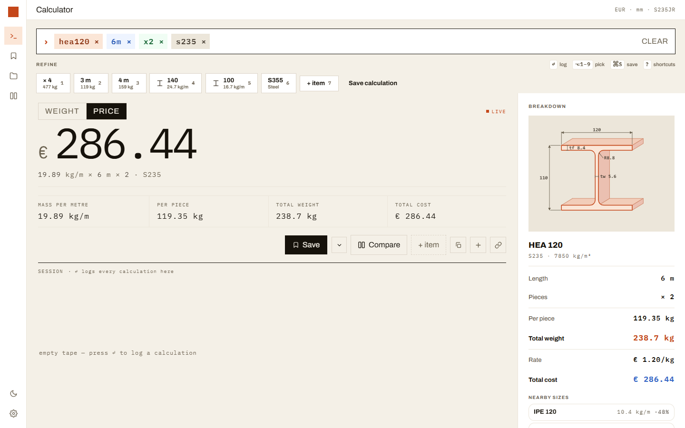
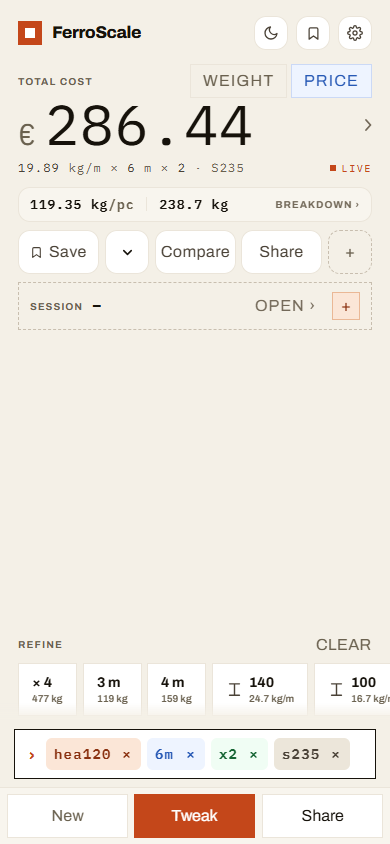

# Ferroscale

[](https://github.com/nedimperva/ferroscale/actions/workflows/ci.yml)
[](LICENSE)
[](https://nextjs.org/)
[](https://www.typescriptlang.org/)
[](src/components/pwa-register.tsx)

EU-focused metal profile weight and price estimator built around a command bar.
Type a query like `hea120 6m x2 s235` and get a live result — weight, price,
cutting schedule, and quote. No account, no tracking, works offline.

**Live demo: https://ferroscale.nedimp.com/en**



## The command bar

Order-tolerant tokens — profile+size, length, quantity, grade, inline price:

| Query | Meaning |
| --- | --- |
| `hea120 6m x2 s235` | HEA 120 beam, 6 m, 2 pieces, grade S235 |
| `shs40x40x3 6m x10 @2.50/kg` | SHS tube with an inline price override |
| `hea120 6m x2 + ipe200 4m x3` | Multi-item line, priced together |
| `hea120 6m =500kg` | Target query — how many pieces make 500 kg? |
| `plt1500x3000x3 316` | Plate in stainless 316 |

Lengths accept `mm`/`cm`/`m`/`ft`, arithmetic works inside tokens
(`6m-50mm`, `x2+3`), and a pasted cut list becomes a multi-item line.
The query mirrors to `?q=`, so every result is a shareable link.

## Features

- **Calculator** — 20 profile types (manual + EN-standard sizes), steel /
  stainless / aluminum grades, per-grade price book, margin, waste, VAT,
  mass tolerance bands, dimensioned cross-section drawings.
- **Projects** — quotes with sub-assemblies, labor and hardware costing,
  per-project margin, 1D bar + 2D plate cutting optimizers with visual cut
  maps, supplier BOM/RFQ export, printable quotes, CSV export.
- **Library** — saved parts and assemblies, templates (incl. standard EN
  fabrication assemblies), compare, session tape, offline JSON backup.
- **Sync & privacy** — local-first; optional Google Drive sync of an
  AES-GCM-encrypted snapshot. No account, no analytics.
- **Platform** — PWA with offline support, light/dark themes, English +
  Bosnian (`en`/`bs`), phone keypad and desktop workspace layouts.



## Accuracy

- Dataset version `2026.07.1`
  (`packages/metal-core/src/datasets/version.ts`).
- The live engine is validated against published EN catalog masses and
  independent hand-computed formulas: **200+ cases, ≤0.5% tolerance**.
- The same benchmark runs as a vitest gate in CI and as an interactive
  table in the app at `/qa`.

## Quickstart

Prerequisites: Node.js 20+, npm 10+. No env vars needed to run.

```bash
npm install
npm run dev        # http://localhost:3000 (root redirects by locale)
```

Open `http://localhost:3000/en` directly (root `/` is a locale redirect).

```bash
npm run build      # production build (prebuild injects the SW cache version)
npm run lint       # ESLint — CI treats it as a hard gate, keep it green
npm run test       # web vitest suite
npm run test:core  # metal-core suite (parser, suggestions, engine)
npm run test:all   # both suites
npm run i18n:check # en/bs message parity — fails CI when locales drift
```

Single test file: `npx vitest run src/lib/calculator/engine.test.ts`.
E2E: `npx playwright test` (set `PLAYWRIGHT_CHROMIUM_EXECUTABLE` to reuse
a system Chromium instead of downloading browsers).

## Workspace layout

- `src/` — Next.js app. `src/lib/calculator/*` and `src/lib/datasets/*`
  are one-line re-export shims over metal-core; web-only logic lives in
  `src/lib/command/` (`share.ts`, `csv.ts`, `profile-specs.ts`, …).
- `packages/metal-core/` — shared, UI-independent package: engine,
  validation, units, datasets, command parser/suggestions. Kept free of
  web imports and i18n so non-web surfaces can reuse it.
- `messages/` — `en.json` + `bs.json` (bs deep-merges over en).
- `docs/` — `DESIGN_REVIEW.md` (architecture review + roadmap),
  `PROJECT_TRACKER.md`, `FEATURE_IMPROVEMENTS.md`, `IMPROVEMENT_IDEAS.md`.

Every app route renders the client-side `CommandShell`; see `AGENTS.md`
for the command flow, profile system, and sync-layer conventions.

## Shared core API

From `@ferroscale/metal-core`:

- Calculator: `calculateMetal`, `validateCalculationInput`, `resolveAreaMm2`
- Command: `cmdParse`, `cmdTokenize`, `cmdSuggest`, `inputToQuery`
- Datasets: profile/material definitions and helpers

## Configuration

| Variable | Required | Purpose |
| --- | --- | --- |
| `NEXT_PUBLIC_SITE_URL` | Deploy only | Base URL for sitemap, robots, and metadata (defaults to `https://ferroscale.nedimp.com`) |
| `RESEND_*` | No | Contact-form email; form logs and rate-limits without them |
| `GOOGLE_*` | No | Drive sync only; everything else works without them |

Local `.env` files are gitignored — never commit secrets.
See [SECURITY.md](SECURITY.md).

## API routes

- `GET /api/health`, `GET /api/captcha`, `POST /api/contact` (rate-limited)
- `src/app/api/sync/google/*` — Drive appdata sync (reads env at request
  time, so builds need no secrets)

## Contributing

See [CONTRIBUTING.md](CONTRIBUTING.md) — setup, test gates, i18n rule
(every string in **both** `en` and `bs`), changelog rule (update
`CHANGELOG.md` **and** `src/lib/changelog.ts`), and the profile-adding
checklist.

## License

MIT — see [LICENSE](LICENSE).
